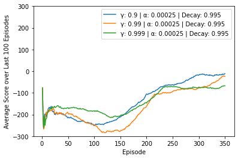
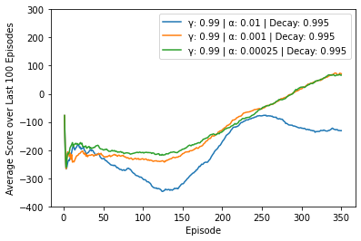
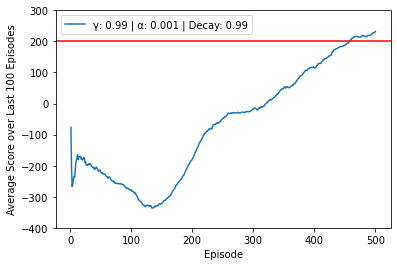
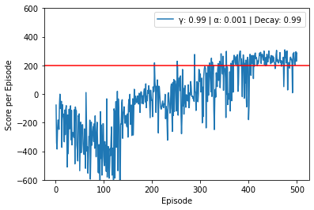
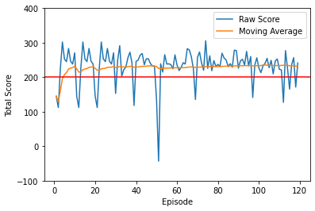

## Project Overview

In this project, I implemented and trained a reinforcement learning agent to successfully land the “Lunar Lander” from the OpenAIgym library. I used a Deep Q Network in order to do so, and Int through a series of hyperparameter tuning to properly construct the learning agent. 

## The Lunar Lander

The Lunar Lander is a 2D game available on the OpenAI
gym library with the goal of landing a shuttle on a
landing pad, using a series of thrusts to control it. More
specifically, there are fmy actions available - do nothing, fire
the left orientation engine, fire the right orientation engine
and fire the main engine. The rewards in this environment
depend on a number of factor. First, if the lander moves away
from the landing pad, it is penalized by the same amount
of reward it would gain by moving towards the landing pad.
Each orientation thrusts occurs a penalty of -0.03 points, and
firing the main engine thrust occurs a penalty of -0.3 points.
Each leg-ground contact is worth +10 points, and an episode
terminated when the shuttle crashes or comes to rest, resulting
in -100 points and +100 points respectively. The game is
considered solved when achieving a score of 200 points or
higher on average over 100 consecutive runs.
The Lunar Lander environment can be represented by an
8-dimensional state,consisting of the horizontal and vertical positions, the
horizontal and vertical speeds, and the angle and
angular speed of the lander. The last two states are binary indicators of whether the legs of the lander have touched ground.

In the traditional Q-learning algorithm, solving the Lunar
Lander would imply the use of a Q table - a table containing
the Q values for every state-action pair in the environment. In the case of the Lunar Lander, and countless other
examples, this becomes practically impossible, since the state space is continous. In order to overcome this problem, I used a neural network to make predictions of Q values for a state-action pair - this methodology is known as a Deep Q Learner.

## Deep Q Network

### Experience Replay

I built a neural network with replay memory. This is a common methodology in the field of reinforcement learning - with the main idea being the use of two neural networks for the learning agent. The first one is used to make predictions, and the other one is periodically updated. This allows for more efficient use of memory and usually leads to better convergence.

### Neural Network Structure

The neural network I built consisted of 2 hidden layers, each with 64 nodes. The initial batch size was set to 32 samples, and the maximum memory capacity set to 50k - with the understanding that the game can take around 1000 steps to successfully land. This means that the agent would try to learn, on aveage, from the most recent 50 episodes.

I used the Relu activation function for the NN given the non linearity of the lander. I also tested three different optimizer - SDP, Adam and RMSProp, but the optimizer did not appear to be a major factory in performance. I ended up choosing the Adam optimizer.

## Hyperparameter Tuning

### Discount Rate tuning.

The discount rate is used to give a sense of how much
to value future rewards as opposed to current reward. I initalized the rate with a value of 0.99 and tested out on two other values. First, note that the tuning was only performed over 350
episodes, which as you can see from the graph above, is not
enough to solve the Lunar Lander. I did not tune until
solving simply due to time constraints.

The general trend from the graph above
is observed across all three values of γ. From episode 20-
150, I see that the agent performs poorly, as it is still in
its exploration phase. But once it passes that phase, all three
agents start learning and at the end of the 350th episode, the
γ = 0.9 and γ = 0.99 curves are fairly close to each other. my
current graph would suggest that γ = 0.9 is a slightly better
solution, but the further exploration revealed that γ = 0.99
converged faster and more smoothly to a solving agent (not
shown above for the same time constraints brought up earlier.)
Intuitively, this order of magnitude for the discount rate makes
sense, given that each episode of the Lunar Lander typically
takes a few hundred time steps - so I need to be looking at
the very least, a few hundred time steps in the future to best
understand how to value reward.

### Learning Rate Tuning

The learning rate
is simply the degree to which I step in the direction of my
gradient. There’s a trade-off betIen taking small and large
steps. Small steps are often safer and will eventually lead to
a solution, but can also be stuck at a local minima and be
extremely slow. Large steps can overcome local minima, but
can also overestimate steps and led to diverging results. With the optimal discount rate, I approached the exploration of the learning way in a similar way.

The results of my learning rate tuning are fairly intuitive - a value of of α = 0.01 proved to be too large and
produced diverging results towards the 250th episode. The
other two learning rates Ire very closely aligned and display
a pattern that suggest that both would improve performance
and eventually converge. I can extrapolate that both learning
rates are small enough to lead to convergence, and I will
retain the larger value of α, as it will do so more quickly. The
optimal learning rate is α = 0.001

### Exploration Rate Tuning

Exploration
refers to taking a random action purely for the sake of
exploring the options I have at a given state and uncovering rewards that I may not have come across otherwise.
Exploitation refers to taking an action, based on what I
expect the outcome to be - i.e., the action that maximizes
Q. As my agent learns, I expect its exploitation to be more
and more optimal, but in order to get there, it needs to have
enough exploration. I use a value of epsilon to determine
whether I will explore or exploit at a given point in time,
and as I go from episode to episode, I will decrease that
epsilon exponentially, using a decay rate. This will ensure that
I do more exploration at first, and as time goes on, more
exploitation.

I can clearly see that too small of a decay produces far
worst results in the early stages - this is simply a result of my
agent being asked to make predictions far too early, before it
has been able to properly learn. The curves for the decay rates
of 0.99 and 0.995 are fairly aligned even if there is still about
a 200 episode difference before their agent reaches maximum
exploitation. I can also see that the rate of 0.99 produced
a better performance. This would suggest that the additional
exploration produced by the 0.995 rate is not necessary. Hence,
my optimal value of decay rate is 0.99

## Performance

After implementing a DQN with the methodology described
above, I succeeded in building an agent that solves the lunar
lander within 500 episodes, with γ = 0.99, α = 0.01 and
decay = 0.99. In the graph below, I have plot the average
score of the last 100 episodes, as I trained the agent over
500 episodes

Around the 450th episode, my have
by definition, solved the Lunar Lander. Perhaps one of the
most interesting feature of this graph is how quickly my reach
convergence after starting to consistently gain positive scores.
It takes roughly 300-320 episodes before, on average, my
agent stars earning positive rewards. Then, it takes it about
150 more episodes before it consistently earns a score of 200
or above. The main reason my observe this pattern is due to
the learning phases of the agent. In the early stages, the agent
will rarely encounter landing, and will be focus on minimizing
negative reward by learning the best thrusting procedures to
not diverge from the landing pad. In later stages, the Lunar
Lander will start to encounter landing more frequently and
learn to maximize reward by successfully landing. The early
stages require more learning, as the agent knows next to
nothing. Once it enters the later learning stages, it only needs
to focus on learning how to land, by fine tuning its previously
determined thrusting procedures. my agent has an easier time
finalizing its learning, and hence why my observe a faster
climb from 0 to 200, compared to -400 to 0.

Another interesting feature of my plot is the variability
in trend. Specifically, my observe a downwards trend in
performance up until the 150th episode or so, after which,
performance steadily increases up until the 250th episode, at which point my see a plateau for about 50 more episodes. To
better understand these variations, let’s take a look at the raw
score per episode, rather than the moving average over the last
100.

In the figure above, my agent starts off
performing poorly in the first 150 episodes or so - which
makes sense given that it is still in its exploration phase, given
my decay rate. Around the 150th episode, my agent starts to
make predictions more often and more accurately. However,
my still have some highly unstable predictions even after a
few hundred episodes. Meaning that, even though my agent
is demonstrating learning, it occasionally runs into scenarios
that it does not handle well, and obtains poor scores.

This high degree of instability is referred to as "catastrophic forgetting."" Simply put, it is when an
agent drastically decreases in performance after a period of
learning. While catastrophic learning seem to refer to more
prolonged period of poor performances after learning (not
necessarily reflected in my results), my still observe instances
of negative scores even after 300+ episodes. These fluctuations
in performance are not uncommon in DQN processes, even
though my already have some measures in place to mitigate
this instability, such as experience replay and fixed targets.
These large fluctuations are simply the results of instability
of approximating Q over a large state space - simply put, my
neural network struggled to generalize well, given the huge
number of states that it has not yet seen. It is also highly likely
that, while my have found hyperparameters that allowed my
agent to solve the Lunar Lander, they are still sub optimal and
are causing some of this variability

Finally, my can also observe how my agent performs on
multiple episodes of the game, after having been trained. The
following is plotted below:

Broadly speaking, my agent does very well as it plays
the game. The orange line suggests that its average score is
consistently above the 200 mark. However, my can see a lot
of fluctuations in the raw score per episode. In most cases my
agent still scores above 100, but there is one instance of a
sub 0 score - this is a result of the high instability discussed
above